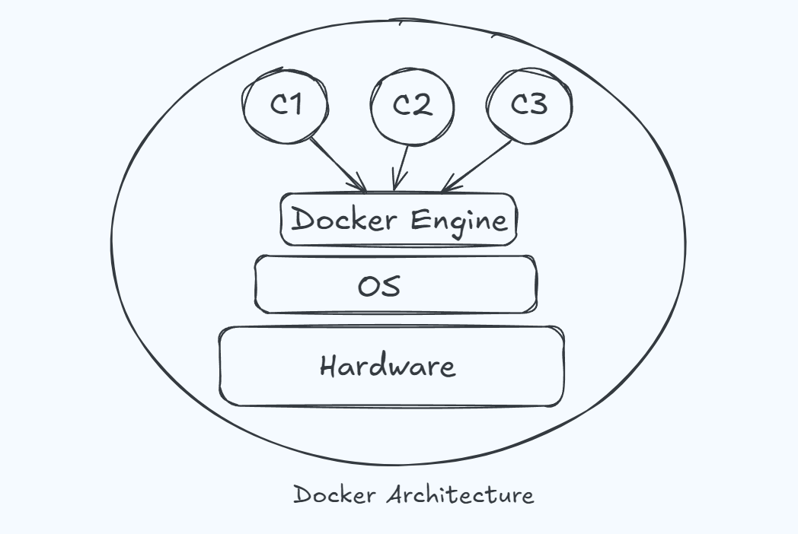
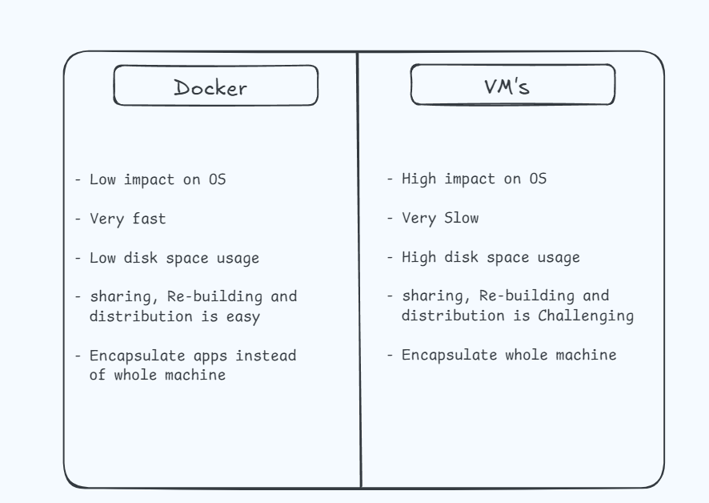
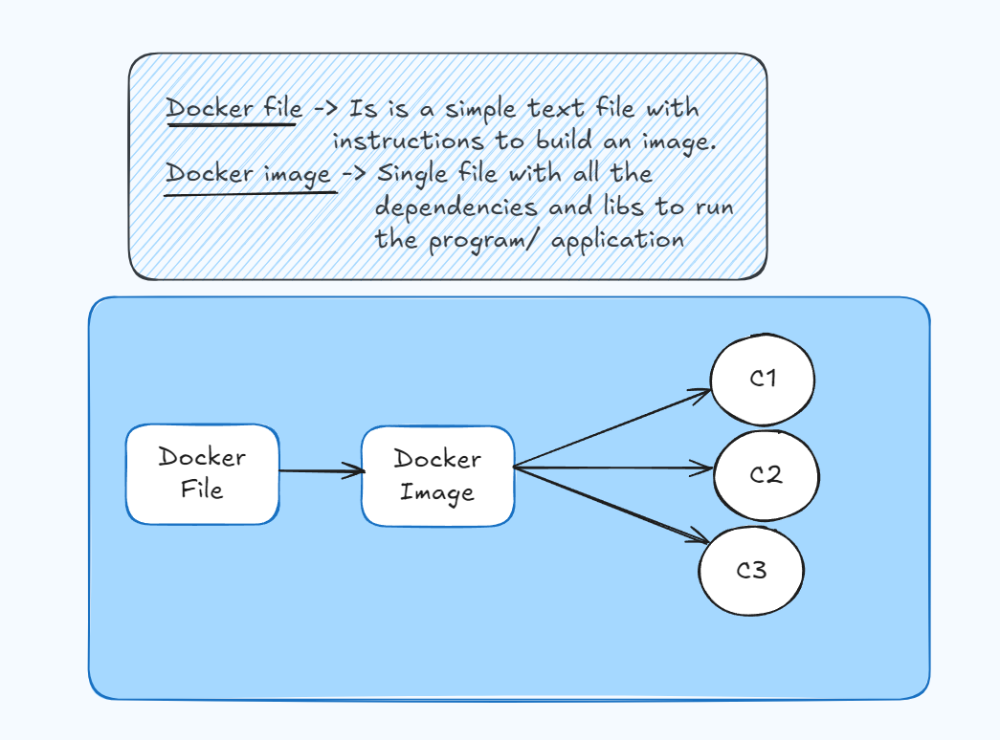

Video link : ` https://www.youtube.com/watch?v=OhnTMWmfTBE&list=PL0tP8lerTbX1m-Z1Dj7M-k-PuKDNJkRul&index=6 `

# Docker

`what is a Docker ?` - `Docker is not the only way to create a Container but it's the most popular one`
- Docker is a containerization platform for developing, packaging, shiping and running application 
- we can say that docker provides us a platform to perfrom SDLC operation on our project.
- i.e. Development, testing, deploying etc.
- Docker let us the ability to run an application in an isolated enviroment known as a container.
- It makes deployment and development efficient.

`What is a Container ?`
- It's a way to package an application with all the necessary dependencies and configurations.
- It can be easily shared.
- This makes development and deployment efficient.

# Architecture

- Here C1, C2, C3 are container 1, 2, 3 respectively.
- These containers are issolated from each other. 

# Difference between Docker and VM's (Virtual Machine's)



## Main components of Docker
- Docker File -> `Simple text file to write all the configurations/ instructions to build the image and use to build the docker image with the help of docker Engine`
- Docker Image -> `Single file with all the dependencies and libraries to run the project/ program`
- Docker Container -> `Process/ Instance with all necessary dependencies and libraries`
- Docker Registry -> `It's a central repo for storing and distributing Docker Images.`




## Commands for Docker
- To check the docker version `docker -v`
- To check the list of runnig docker containers process status `docker ps`
- To check the list of all the containers process status `docker ps -a`
- To create an image from docker file `docker build .`
- To check the list of docker images  `docker image ls`
- To run the image we need imageID i.e. creating a container `docker run _imageID_` this only run image in container
- To run the image on machine
```
docker run -p l_port:c_port _imageID_   -> to run run container on local machine
                OR
docker run -d -p l_port:c_port _imageID_    -> to run container in detached mode on local machine
```

## Docker File Format
```
- FROM _BASE_IMAGE_
- WORKDIR /WORKING DIRECTORY
- COPY . .  -> Its for copy current directory data inside our image
- RUN npm i   -> This commands installs all the necessary packages to run our proj.
- CMD ['npm','start']  -> CMD ["Executable","Command"]
```

## How to stop a container
```
- open a new terminal
- go to project directory
- docker ps
- copy name of the container which you want to stop
- docker stop _container_name_
```

